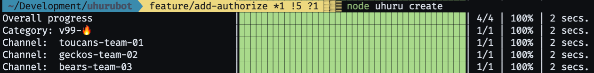

[contributors-shield]: https://img.shields.io/github/contributors/chingu-x/uhurubot.svg?style=for-the-badge
[contributors-url]: https://github.com/chingu-x/uhurubot/graphs/contributors
[forks-shield]: https://img.shields.io/github/forks/chingu-x/uhurubot.svg?style=for-the-badge
[forks-url]: https://github.com/chingu-x/uhurubot/network/members
[stars-shield]: https://img.shields.io/github/stars/chingu-x/uhurubot.svg?style=for-the-badge
[stars-url]: https://github.com/chingu-x/uhurubot/stargazers
[issues-shield]: https://img.shields.io/github/issues/chingu-x/uhurubot.svg?style=for-the-badge
[issues-url]: https://github.com/chingu-x/uhurubot/issues

[![Contributors][contributors-shield]][contributors-url]
[![Forks][forks-shield]][forks-url]
[![Stargazers][stars-shield]][stars-url]
[![Issues][issues-shield]][issues-url]

# uhurubot

Uhuru automates the process of sending and posting routine adivice to members
of Chingu.

[Process Overview](#process-overview) - [Installation](#installation) - [Usage](#usage) - [Release History](#release-history) - [License](#license)



## Process Overview

Uhurubot posts helpful information to new Chingu's to help them get started on their
Solo Project. This is  run based on a predefined schedule using an external 
scheduler

## Installation

To install this app:
```
git clone https://github.com/chingu-x/uhurubot.git
npm i
```

To run the app check out the information in the *_'Usage'_* section below.

Uhurubot must be defined in the Discord server and granted administrator
permissions. 
## Usage

Uhurubot is a command line application (CLI). The basic command to run it is:
```
node uhurubot <option> <flags>
```
| Option     | Description                                 | Permissable flags |
|------------|---------------------------------------------|-------------------|
| build      | Build the config file for Voyage teams      | -voyage           |
| create     | Create channels for a Voyage                | -v, -t            |
| authorize  | Authorize users to access channels          | -v, -t            |
| post       | Post a message in the `#team-advice` channel | -v, -p           |
| email      | Email members based on a specific schedule  | -s                |

Before running it you'll first need to identify option values you'll using 
in both the command line and the CLI `.env` file. 

| CLI Flag        | `.env` Parm    | Description                              |
|-----------------|----------------|------------------------------------------|
| -c, --voyage    | VOYAGE         | Voyage number |
| -v, --validate  | VALIDATE       | Validate (Y/N) authorization actions     |
| -t, --teams     | TEAMS          | Teams & users (JSON file) path |
| -p, --posts     | POSTS          | Channel post specifications (JSON file) path |
| -s, --schedule  | SCHEDULE       | Email schedule specifications (JSON file) path |
 
It's important to keep in mind that options you supply on the command line
ALWAYS override the same option you specify in the `.env` file.

`env.sample` in the root of the project contains a sample of how to set up a `.env` file.

### Configuration files

Due to the complexity of the data required to setup channels, authorize users,
and manage channel posts command line parameters are not a good solution for
specifying the parameters needed to guide these operations.

Instead, CLI parameters defining JSON files containing the necessary
specifications are used. The following sections define the format and content
of these files.

Since multiple Voyages may be underway at the same time file names for these
files will follow the following naming convention so configuration files can
maintained in the same file system directory:

- Teams & Users: `vnnnnn_teams_users`
- Posts: `vnnnnn_posts`
#### Teams & Users

The following shows the format of the Teams & Users JSON file:

```
{
  "voyage_number": "nn",
  "categories": [
    { "name": "vnn-tier1-01-🔥" },
    ...
  ],
  "teams": [
    {
      "team": { 
        "name": "tiern-team-nn",
        "category": "category-name",
        "tier": "tier1|tier2|tier3",
        "discord_names": ["user1", "user2", "user3",...]
        "github_names": ["user1", "user2", "user3", ...]
      }
    }, ...
  ],
  "team_greeting": [
    "<line-1>",
    "<line-2>",
    ...
    "<line-n>"
  ],
    "tier_greeting": [
    { 
      "tier": "tier1|tier2|tier3", 
      "greeting": [
        "<line-1>",
        "<line-2>",
        ...
        "<line-n>"
      ]
    }
  ] 
}
```
`voyage_number` defines the number of this voyage and is used to construct the
voyage name `Vnn`.

- `channel-name` defines the channels name (Duh!)
- `greeting` specifies the message (Markdown) to be added to it

`<tiern-team-nn>` should be replaced with a unique team name. For example,
`tier1-team-01`. By default these are private Discord team channels and access 
is granted only to members of that team.

`categories` defines the unique category names used to group Discord team 
channels. These are restricted to 50 team channels per category and category
names should be formatted as `vnn-tiern-gg-🔥` where:

- `vnn` is the Voyage name
- `tiern` is the tier name - `tier1`, `tier2`, or `tier3`
- `gg` is the group number used to make the category unique and distinct from
other category names in the same Voyage.

`discord_names` defines the Discord users that are in that team. The user
names in this array must be valid Discord users who have joined the Chingu
server.

`github_names` defines the Github account names for everyone in a team. The
names in this array must be valid GitHub user names for those who are in this
team.

`team-greeting` defines the message (Markdown format) that is to be posted to
each teams channel.

`tier-greeting` defines a message (Markdown format) that is to be posted to
every team channel in the matching tier, as specified by the `tier` attribute.

#### Email Scheduled

The following shows the format of the Email Schedule specifications JSON file
```
{
  "name": "soloproject_notification",
  "schedule": [
    {
      "dayOfWeek": "Friday",
      "admissionOffset": 1,
      "messageID": "SOLOPROJECT_NOTIFICATION_1",
      "messageDescription": "How to select project?"
    }, {
      "dayOfWeek": "Monday",
      "admissionOffset": 4,
      "messageID": "SOLOPROJECT_NOTIFICATION_2",
      "messageDescription": "What is Pair Prog. & how to use it for Solo Project?"
    }, {
      "dayOfWeek": "Wednesday",
      "admissionOffset": 6,
      "messageType": "SOLOPROJECT_NOTIFICATION_3",
      "messageDescription": "How to submit Solo Project & signup for Voyage?"
    }, {
      "dayOfWeek": "Friday",
      "admissionOffset": 8,
      "messageType": "SOLOPROJECT_NOTIFICATION_4",
      "messageDescription": "How to add Solo Project to your social media profile?"
    }, {
      "dayOfWeek": "Monday",
      "admissionOffset": 11,
      "messageType": "SOLOPROJECT_NOTIFICATION_5",
      "messageDescription": "Last Solo Project notification, but don't give up!"
    }
  ]
}
```

The `name` attribute uniquely identifies the schedule. For a given run the 
CLI `-s` parameter specifies which schedule is to be used.

The `schedule` section includes one entry for each email that could be sent.

- `dayOfWeek` defines the day name of the week the email is to be sent, but is
purely documentational and is not used for scheduling.

- `admissionOffset` specifies the relative day after the Chingu's admission date
the email is to be sent.

- `messageType` is a logical identifier UhuruBE uses to identify which unique
MailJet template is to be used. 

- `messageDescription` is purely documentational and is not used for scheduling.

#### Post Specifications

> **_Coming Soon!_**

The following shows the format of the Post specifications JSON file:

```
{
  "voyage": {
    "voyage_number": "nnnnn",
    "schedule": [
      { 
        "sprint_number": "nn",
        "start_date": "yyyy-mm-dd",
        "end_date": "yyyy-mm-dd"
      },
      ...
    ],
  }, 
  "posts": [
    {
      "sprint_number": nn,
      "sprint_day": "daynameofweek",
      "channel": "channelname",
      "message": "messagetext"
    }, {
      "sprint_number": nn,
      "sprint_day": "daynameofweek",
      "channel": "categoryname/channelname",
      "message": "messagetext"
    },
    ...
  ]
}
```

The `voyage` section defines the voyage number, number of sprints, and the
date range for each sprint. 

- `voyage_number` is a character string that defines
a unique identifier for the Voyage. It may be either numeric or a string. Numeric
Voyage numbers need not contain leading zeros.

- `schedule` contains an array of objects defining each sprint and its start
and end dates. This is used to map posts scheduled for a particular sprint and
day of the week (e.g. Monday) to a specific date for a Voyage.

The `posts` section defines the messages to be added to a channel on an
specific day of a sprint.

- `sprint_number` & `sprint_day` are used along with the Voyage schedule to
identify the specific date the message is to be posted.

- `sprint_day` may be specified as the day name (e.g. 'monday'). Any case is 
valid.

- `channel` specifies the specific channel the message is to be posted into.
For example, `VOYAGE-30/team-advice` or `chingu-news-v31-📰`. When a channel is
a member of a category the category name must be specified followed by a
slash (i.e. '/') and the channel name.

- `message` is the Markdown formatted text to be added to a channel.

### CLI Examples

#### Example #1 - Build Users config file from Airtable

Prior to provisioning Discord channels and Github repos for a Voyage the `build`
command can be used to generate the users config file.
```
node uhurubot build -t /Users/jim/Development/uhurubot/config/v31_teams_users.json
```

#### Example #2 - Create Channels prior to New Voyage

In a terminal session issue the following to create Discord channels for a
specific voyage: 
```
node uhurubot create -t /Users/jim/Development/uhurubot/config/v31_teams_users.json
```

Example contents for the `v31_teams_users` file:

```
{
  "voyage_number": "31", 
  "categories": [
    { "name": "v31-tier1-01-🔥" },
    { "name": "v31-tier2-02-🔥" },
    { "name": "v31-tier3-03-🔥" }
  ]
  "teams": [
    {
      "team": { 
        "name": "toucans-team-01", 
        "category": "v31-tier1-01-🔥",
        "tier": "tier1"
        "discord_names": ["fred#9871", "mary#7626", "rakesh#8878"],
        "github_names": ["fredgh", "marygh", "rakeshgh"]
      },
    }, {
      "team": { 
        "name": "toucans-team-02",
        "category": "v31-tier1-01-🔥",
        "tier": "tier1"
        "discord_names": ["princess#1774", "grace#7716", "charles#8928"],
        "github_names": ["princessgh", "gracegh", "charlesgh"]
      },
    }, {
      "team": { 
        "name": "geckos-team-03",
        "category": "v31-tier2-02-🔥",
        "tier": "tier2"
        "discord_names": ["nygen#4762", "tim#4888", "bethany0925"],
        "github_names": ["nygengh", "timgh", "bethanygh"] 
      },
    }, {
      "team": { 
        "name": "bears-team-04",
        "category": "v31-tier3-03-🔥",
        "tier": "tier1"
        "discord_names": ["singh#1243", "marcus#0997", "frieda#9661"],
        "github_names": ["singhgh", "marcusgh", "friedagh"] 
      },
    }, {
      "team": { 
        "name": "bears-team-05",
        "category": "v31-tier3-03-🔥",
        "tier": "tier3"
        "discord_names": ["maria#9684", "mailia#6165", "nicola#3333"],
        "github_names": ["mariagh", "mailiagh", "nicolagh"] 
      },
    }, {
      "team": { 
        "name": "bears-team-06",
        "category": "v31-tier3-03-🔥",
        "tier": "tier3"
        "discord_names": ["ralph#1234", "jane#3489", "ling#2345"],
        "github_names": ["princessgh", "gracegh", "charlesgh"] 
      },
    }
  ],
  "team_greeting": [
    "**__Welcome to your Voyage Team Channel__**\n",
    "Use this channel to communicate & collaborate with your teammates!",
  ],
  "tier_greeting": [
    { 
      "tier": "tier1", 
      "greeting": [
          "**__Tier 1 Team Project__**\n",
          "If you are a Toucans (tier 1) team you are required to create the **_Chuck Norris Quotes_** app. All Toucans teams are required to create this same application from these requirements & specifications --> https://github.com/chingu-voyages/voyage-project-tier1-norris."
        ]
    }
  ] 
}
```

After completion the Chingu Discord server will contain the following new
categories and channels organized as follows:

- `#v31-tier1-01-🔥`
  - `#tier1-team-01`
  - `#tier1-team-02`
  - `#toucans-team-01av`
  - `#toucans-team-02av`
- `#v31-tier2-02-🔥`
  - `#geckos-team-03`
  - `#geckos-team-03av`
- `#v31-tier3-03-🔥`
  - `#bears-team-04`
  - `#bears-team-05`
  - `#bears-team-06`
  - `#bears-team-04av`
  - `#bears-team-05av`
  - `#bears-team-06av`

All channels are private channels and are not visible to `@everyone`. The 
`create` function doesn't grant any team access to the channels it creates.
Access is granted by the `authorize` function since to allow teams to be created
in advance.

Team channels ending in the team number are text channels. Those ending in `av`
are voice channels.

Note that the `v31_teams_users` file omitted the `discord_names` and 
`github_names` attributes since it's optional for the `create` function. 
However, if included they will be ignored.

#### Example #3 - Authorize Discord Users to access their Voyage Channels

In a terminal session issue the following to authorize Chingu's to access
their team channels for a voyage:
```
node uhurubot authorize -t /Users/jim/Development/uhurubot/config/v31_teams_users.json
```

Example contents for the `v31_teams_users` file:

```
{
  "voyage_number": "31", 
  "categories": [
    { "name": "v31-tier1-01-🔥" },
    { "name": "v31-tier2-02-🔥" },
    { "name": "v31-tier3-03-🔥" }
  ]
  "teams": [
    {
      "team": { 
        "name": "toucans-team-01", 
        "category": "v31-tier1-01-🔥",
        "tier": "tier1"
        "discord_names": ["fred#9871", "mary#7626", "rakesh#8878"],
        "github_names": ["fredgh", "marygh", "rakeshgh"]
      },
    }, {
      "team": { 
        "name": "toucans-team-02",
        "category": "v31-tier1-01-🔥",
        "tier": "tier1"
        "discord_names": ["princess#1774", "grace#7716", "charles#8928"],
        "github_names": ["princessgh", "gracegh", "charlesgh"]
      },
    }, {
      "team": { 
        "name": "geckos-team-03",
        "category": "v31-tier2-02-🔥",
        "tier": "tier2"
        "discord_names": ["nygen#4762", "tim#4888", "bethany0925"],
        "github_names": ["nygengh", "timgh", "bethanygh"] 
      },
    }, {
      "team": { 
        "name": "bears-team-04",
        "category": "v31-tier3-03-🔥",
        "tier": "tier1"
        "discord_names": ["singh#1243", "marcus#0997", "frieda#9661"],
        "github_names": ["singhgh", "marcusgh", "friedagh"] 
      },
    }, {
      "team": { 
        "name": "bears-team-05",
        "category": "v31-tier3-03-🔥",
        "tier": "tier3"
        "discord_names": ["maria#9684", "mailia#6165", "nicola#3333"],
        "github_names": ["mariagh", "mailiagh", "nicolagh"] 
      },
    }, {
      "team": { 
        "name": "bears-team-06",
        "category": "v31-tier3-03-🔥",
        "tier": "tier3"
        "discord_names": ["ralph#1234", "jane#3489", "ling#2345"],
        "github_names": ["princessgh", "gracegh", "charlesgh"] 
      },
    }
  ],
  "team_greeting": [
    "**__Welcome to your Voyage Team Channel__**\n",
    "Use this channel to communicate & collaborate with your teammates!",
  ],
  "tier_greeting": [
    { 
      "tier": "tier1", 
      "greeting": [
          "**__Tier 1 Team Project__**\n",
          "If you are a Toucans (tier 1) team you are required to create the **_Chuck Norris Quotes_** app. All Toucans teams are required to create this same application from these requirements & specifications --> https://github.com/chingu-voyages/voyage-project-tier1-norris."
        ]
    }
  ] 
}
```

Upon completion of this command team members are granted update access to their team text channel and access
to their teams voice channel (e.g. `tier1-team-01av`). No access, read-only or
otherwise, is granted to non-team members other than administrators who by 
default have access to all channels in the server.

Note that the `v31_teams_users` file MUST contain the `discord_names` attributes
since it's required to grant access.

In addition, even though GitHub user names are included in users config file 
it is not used by Uhurubot at this time. However, these are used by Zeldabot to
authorize GitHub teams access to the team repos it creates.

#### Example #4 - Email Chingus based on a Schedule

In a terminal session issue the following to send emails to Chingu's based on
the specified schedule:
```
node uhurubot email -s soloproject_advice_schedule
```
Example contents for the `soloproject_advice_schedule` file:
```
{
  "name": "soloproject_notification",
  "schedule": [
    {
      "dayOfWeek": "Friday",
      "admissionOffset": 1,
      "messageID": "SOLOPROJECT_NOTIFICATION_1",
      "messageDescription": "How to select project?"
    }, {
      "dayOfWeek": "Monday",
      "admissionOffset": 4,
      "messageID": "SOLOPROJECT_NOTIFICATION_2",
      "messageDescription": "What is Pair Prog. & how to use it for Solo Project?"
    }, {
      "dayOfWeek": "Wednesday",
      "admissionOffset": 6,
      "messageType": "SOLOPROJECT_NOTIFICATION_3",
      "messageDescription": "How to submit Solo Project & signup for Voyage?"
    }, {
      "dayOfWeek": "Friday",
      "admissionOffset": 8,
      "messageType": "SOLOPROJECT_NOTIFICATION_4",
      "messageDescription": "How to add Solo Project to your social media profile?"
    }, {
      "dayOfWeek": "Monday",
      "admissionOffset": 11,
      "messageType": "SOLOPROJECT_NOTIFICATION_5",
      "messageDescription": "Last Solo Project notification, but don't give up!"
    }
  ]
}
```


#### Example #5 - Schedule Discord Posts for a Voyage

TBD

## Release History

You can find what changed, when in the [release history](./docs/RELEASE_HISTORY.md)

## License

Copyright 2021-2022 &copy; Chingu, Inc.

Redistribution and use in source and binary forms, with or without modification, are permitted provided that the following conditions are met:

1. Redistributions of source code must retain the above copyright notice, this list of conditions and the following disclaimer.

2. Redistributions in binary form must reproduce the above copyright notice, this list of conditions and the following disclaimer in the documentation and/or other materials provided with the distribution.

3. Neither the name of the copyright holder nor the names of its contributors may be used to endorse or promote products derived from this software without specific prior written permission.

THIS SOFTWARE IS PROVIDED BY THE COPYRIGHT HOLDERS AND CONTRIBUTORS "AS IS" AND ANY EXPRESS OR IMPLIED WARRANTIES, INCLUDING, BUT NOT LIMITED TO, THE IMPLIED WARRANTIES OF MERCHANTABILITY AND FITNESS FOR A PARTICULAR PURPOSE ARE DISCLAIMED. IN NO EVENT SHALL THE COPYRIGHT HOLDER OR CONTRIBUTORS BE LIABLE FOR ANY DIRECT, INDIRECT, INCIDENTAL, SPECIAL, EXEMPLARY, OR CONSEQUENTIAL DAMAGES (INCLUDING, BUT NOT LIMITED TO, PROCUREMENT OF SUBSTITUTE GOODS OR SERVICES; LOSS OF USE, DATA, OR PROFITS; OR BUSINESS INTERRUPTION) HOWEVER CAUSED AND ON ANY THEORY OF LIABILITY, WHETHER IN CONTRACT, STRICT LIABILITY, OR TORT (INCLUDING NEGLIGENCE OR OTHERWISE) ARISING IN ANY WAY OUT OF THE USE OF THIS SOFTWARE, EVEN IF ADVISED OF THE POSSIBILITY OF SUCH DAMAGE.
